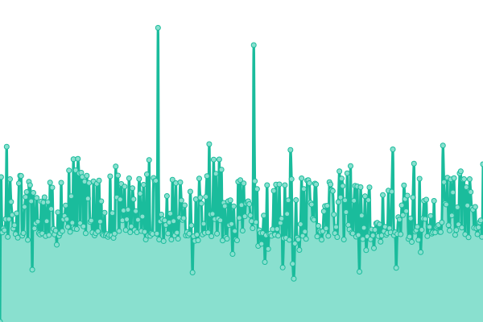

# [📈 Live Status](https://status.xcraimax.de): <!--live status--> **Alle Systeme sind betriebsbereit**

This repository contains the open-source uptime monitor and status page for [Alexander](https://xCraimax.de/), powered by [Upptime](https://github.com/upptime/upptime).

With [Upptime](https://upptime.js.org), you can get your own unlimited and free uptime monitor and status page, powered entirely by a GitHub repository. We use [Issues](https://github.com/xCraimax/upptime/issues) as incident reports, [Actions](https://github.com/xCraimax/upptime/actions) as uptime monitors, and [Pages](https://status.xcraimax.de) for the status page.

<!--start: status pages-->
<!-- This summary is generated by Upptime (https://github.com/upptime/upptime) -->
<!-- Do not edit this manually, your changes will be overwritten -->
<!-- prettier-ignore -->
| URL | Status | History | Response Time | Uptime |
| --- | ------ | ------- | ------------- | ------ |
|  [Homepage](https://xcraimax.de/robots.txt) | Aktiv | [homepage.yml](https://github.com/xCraimax/upptime/commits/HEAD/history/homepage.yml) | 

 247ms
     
 | 

<a href="https://status.xcraimax.de/history/homepage">100.00%</a>
    

|  [Urbania Nova | Minecraft](212.11.64.102) | Aktiv | [urbania-nova-minecraft.yml](https://github.com/xCraimax/upptime/commits/HEAD/history/urbania-nova-minecraft.yml) | 

 114ms
     
 | 

<a href="https://status.xcraimax.de/history/urbania-nova-minecraft">100.00%</a>
    

<!--end: status pages-->

[**Visit our status website →**](https://status.xcraimax.de)

## 📄 License

- Powered by: [Upptime](https://github.com/upptime/upptime)
- Code: [MIT](./LICENSE) © [Anand Chowdhary](https://anandchowdhary.com), supported by [Pabio](https://pabio.com)
- Data in the `./history` directory: [Open Database License](https://opendatacommons.org/licenses/odbl/1-0/)
